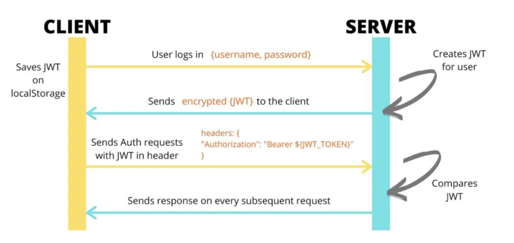

# AskNRA REST API Proof of Concept
#### Conceptual REST API using Python Flask Web Application & JWT Authentication / Authorization

### Working principle


### How to use
1. Clone or download this repository
2. Install the dependencies:
```
$ pip install -r requirements.txt
```
3. Run the server using run.py file:
```
$ python run.py
```
4. The server should be accesible on http://localhost:5000/ 
5. The file **/app/db.py** contains user accounts and data in dictionaries and lists It is used like a database.
6. Open the **/bruno_api_client_requests** folder in [Bruno API Client](https://www.usebruno.com/) to start testing the API.
7. Adjust the token expiration time **JWT_EXPIRATION_TIME** parameter to your needs in the **/app/security.py** file.

### Generic endpoints
* */* : this route doesn't need credentials.
* */login* : client sends username and password in plain text in JSON format ({username:'name',password:'pass'}) (POST). If login is correct, the client receives the JWT token.
* */nra-only*: Only logged user with "nra" rol can acces. Checks the request header named "Authorization" which contains the JWT token obtained after succes login.
* */users-only*: Similar to previous route. Only "user" rol is accepted.

### All Exposed API endpoints (resources)
```
flask routes --sort rule

Endpoint               Methods  Rule                   
---------------------  -------  -----------------------
index                  GET      /                      
netz.get_net           GET      /api/net/<int:param>   
netz.get_search_net    GET      /api/net/search-net    
netz.get_netz          GET      /api/netz              
netz.add_netz          POST     /api/netz              
sitez.get_site         GET      /api/site/<int:param>  
sitez.get_search_site  GET      /api/site/search-site  
sitez.get_netz         GET      /api/sitez             
sitez.add_sitez        POST     /api/sitez             
security.login         POST     /auth/login            
onlyadmins             GET      /nra-only              
static                 GET      /static/<path:filename>
onlyusers              GET      /users-only
```